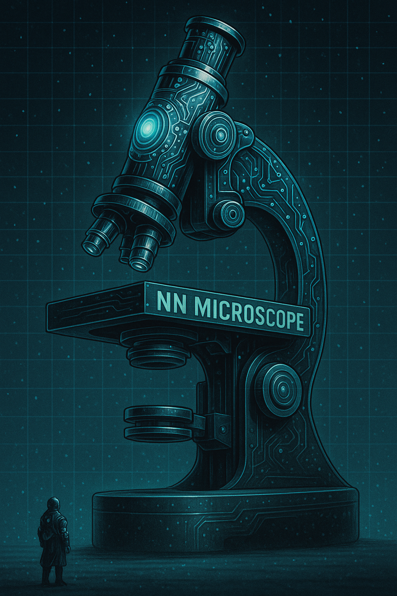
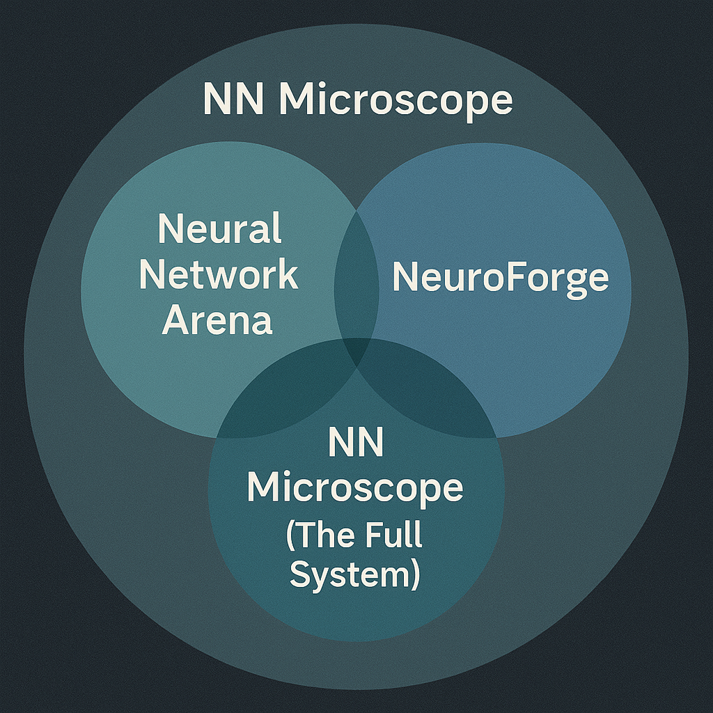

# NN Microscope

**The NN Microscope** is the umbrella system that brings together every component of your neural network workflow — from model training to visualization to large-scale experimentation. It’s not just a tool — it’s a *research lab* designed to give you full control, deep insight, and unmatched clarity into how neural networks behave.

---

## System Overview

The NN Microscope is composed of three distinct but tightly integrated systems:

---

### 🔱 Neural Network Arena (NNA)

- **Gladiators**: The models.
- **Arenas**: The datasets and tasks.
- **Dimensions**: Hyperparameter grids and batch orchestration.

> _This is the **battlefield** — where models are trained, tested, and compared._

---

### 🔧 NeuroForge

- Visual debugger and interactive interface.
- VCR-style playback of training.
- Fully inspectable neuron-by-neuron visualization.
- Supports introspection of weights, signals, activations, thresholds, blame, and more.

> _This is the **workbench** — where you inspect, dissect, and evolve your Gladiators._

---

### 🔬 NN Microscope (The Full System)

- Coordinates **massive experiments** (100s or 1000s of models).
- Auto-records full training history and architecture metadata.
- Combines **Arena**, **NeuroForge**, and **Dimensions** into a unified research instrument.

> _This is the **scientific instrument** — your full-stack lab for neural network exploration._

---

## Philosophy

The NN Microscope is built on a few core principles:

- **Transparency over abstraction**  
  See *everything* your model is doing — at any epoch, in any neuron.

- **Experimentation without friction**  
  Easily launch massive parameter sweeps and compare models in depth.

- **Simplicity with power**  
  Each component (Arena, NeuroForge, Gladiators) is modular and minimal, but the system scales.

---

## Suggested Use

- Keep `README.md` focused on usage and setup.
- Place this file as `Microscope.md` or `readme_Microscope.md` to explain the system metaphor and high-level architecture.

> If you're inside this system, you're not just training models.  
> You're doing science under the lens of the **NN Microscope**.

